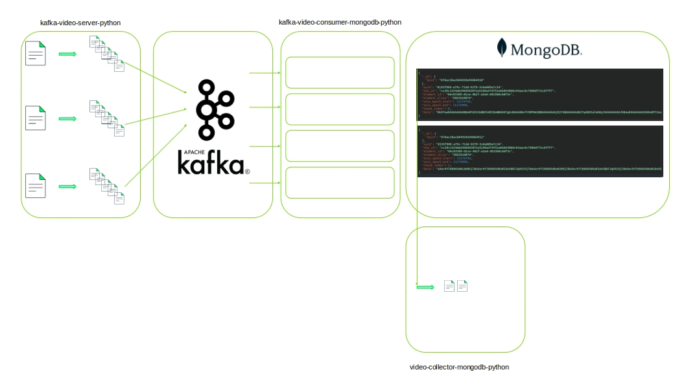

# Proof of Concept: Video Delivery and Persistence System

## Objective

The objective of this proof of concept is to create a system that allows videos to be sent from various sources to a persistence point for potential future queries. This is not about real-time video streaming. Instead, videos are sent gradually as they are completed, broken into chunks, and consulted only in very specific situations. The final reassembled video will be served as a single file, not in streaming or segmented format.

### Use Case

A potential use case could involve sending a video recording of a cash delivery from an armored car to a bank. As the delivery is recorded, it is sent to the server. The video is then stored, with the expectation that it will not be viewed unless required due to a contingency, such as a police or judicial request.

## Components

This proof of concept consists of three components:

1. **[Kafka Video Server (Python)](https://github.com/Javier-Godon/kafka-video-server-python):**  
   This Python component takes a video as input, breaks it into chunks, and sends them to Kafka. The idea is that this component can be installed in any environment where videos need to be sent (e.g., cameras in multiple vehicles that periodically send event-based videos, security cameras from different homes, etc.). The frequency of video transmission is neither fixed nor predictable, and the system ensures the delivery of the complete video.

2. **[Kafka Video Consumer (Python) with MongoDB](https://github.com/Javier-Godon/kafka-video-consumer-mongodb-python):**  
   This component is responsible for receiving video chunks and storing them directly in MongoDB. Each chunk is sent within a JSON structure that identifies the video and its corresponding chunks. This approach avoids the need for modifications or regrouping.  
   MongoDB's [GridFS](https://www.mongodb.com/docs/manual/core/gridfs/) is not used to simplify the architecture. GridFS would require orchestrating the reception and regrouping of video chunks to organize their persistence. This proof of concept opts for simplicity, ensuring functionality on a small scale. Videos are stored and expected to be queried only in exceptional cases, such as court trials or police investigations.

3. **[Video Collector (Python) with MongoDB](https://github.com/Javier-Godon/video-collector-mongodb-python):**  
   This component is used to query the database, regroup all the chunks, and reassemble the video. It serves the complete video file when requested.

## Summary

This proof of concept demonstrates a scalable and straightforward system for sending, persisting, and occasionally querying video files. The architecture ensures the secure delivery and storage of complete videos from diverse sources, accommodating use cases where videos are accessed only under specific circumstances.

## Infrastructure Components and Integration Overview

